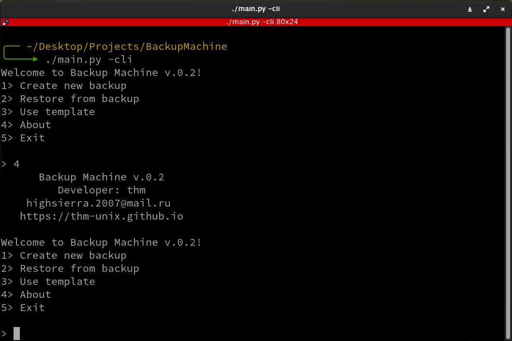
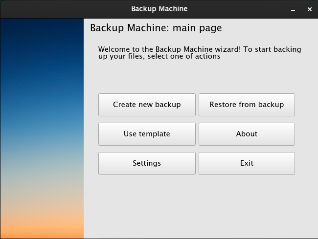
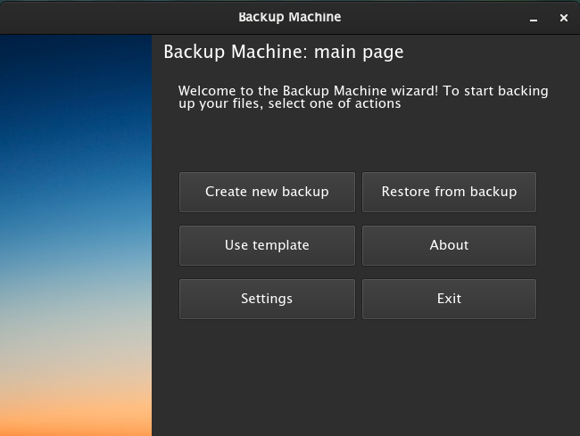
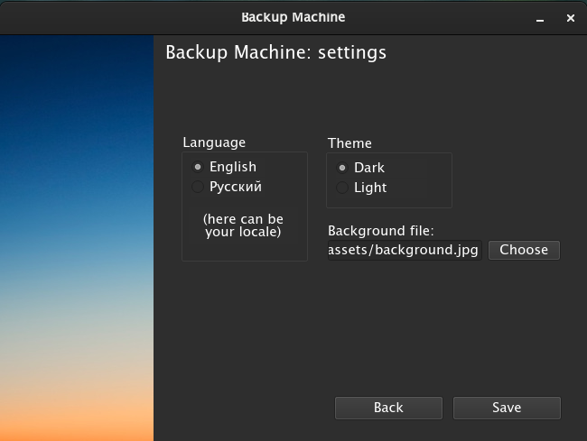
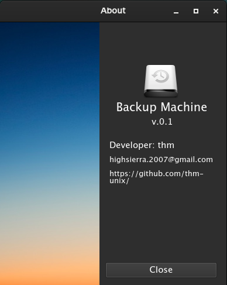

# Backup Machine

A simple program for backing up your files

## Description
This is a Python application which can pack/unpack .tar files. The main feature is 'templates'. You can once create an archive and after that just select the required template to create a new backup.

## Installation
1. (Install Python 3.x)<br>
2. ```pip3 install PyQt5```<br>
3. ```git clone https://github.com/thm-unix/BackupMachine```<br>
4. ```cd BackupMachine```<br>
5. ```chmod +x main.py```<br>
6. (Change the path to main.py in .desktop file)<br>
7. ```sudo cp backupmachine.desktop /usr/share/applications/```<br>

## Localization
<b>English: </b> 100% (by <a href="https://github.com/thm-unix/">thm-unix</a>) <br> 
<b>Russian: </b> 100% (by <a href="https://github.com/thm-unix/">thm-unix</a>) <br> 
(here can be your locale)

## Bugs
Please report any bugs and suggestions.

## Daemonize
Starting from v.0.1.4 you can create a daemon which can create backups automatically because now you can use one of your templates from CLI.<br>
<b>Usage:</b>
./main.py -service -template template_name

## CLI
Now complete CLI mode! (v.0.2 and newer)<br>


## Screenshots
 
 
